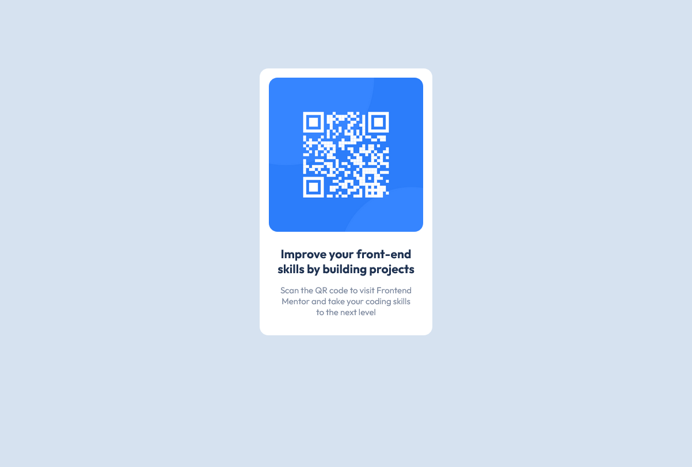

# Frontend Mentor - QR code component solution

This is a solution to the [QR code component challenge on Frontend Mentor](https://www.frontendmentor.io/challenges/qr-code-component-iux_sIO_H). Frontend Mentor challenges help you improve your coding skills by building realistic projects. 

## Table of contents

- [Overview](#overview)
  - [Screenshot](#screenshot)
  - [Links](#links)
- [My process](#my-process)
  - [Built with](#built-with)
  - [What I learned](#what-i-learned)
  - [Useful resources](#useful-resources)
- [Author](#author)

## Overview

### Screenshot

#### Desktop



#### Mobile


### Links

- Solution URL: [Add solution URL here](https://github.com/StijnvdW/frontend-mentor-qr-code-component)
- Live Site URL: [Add live site URL here](https://stijnvdw.github.io/frontend-mentor-qr-code-component/)

## My process

### Built with

- Semantic HTML5 markup
- CSS custom properties
- Flexbox

### What I learned

Centering it on the page:

```css
.card {
    position: fixed;
    top: 50%;
    left: 50%;
    /* bring your own prefixes */
    transform: translate(-50%, -50%);
}
```

Learned to use Flexbox to create a card component. By using column direction to place image and description below each other.

```css
.qr-code {
    display: flex;
    flex-direction: column;
    align-items: center;
    text-align: center;
}
```

Applying border-radius with percentage didn't result in nice borders. Using pixels got a better result.

```css 
.qr-code__image {
    border-radius: 15px;
}
```

### Useful resources

- [StackOverflow](https://stackoverflow.com/questions/31217268/center-div-on-the-middle-of-screen) - This helped me centering a div using CSS3.
- [StackOverflow](https://stackoverflow.com/questions/29966499/border-radius-in-percentage-and-pixels-px-or-em) - Borderradius pixels vs percentage.

## Author

- Frontend Mentor - [@StijnvdW](https://www.frontendmentor.io/profile/StijnvdW)
